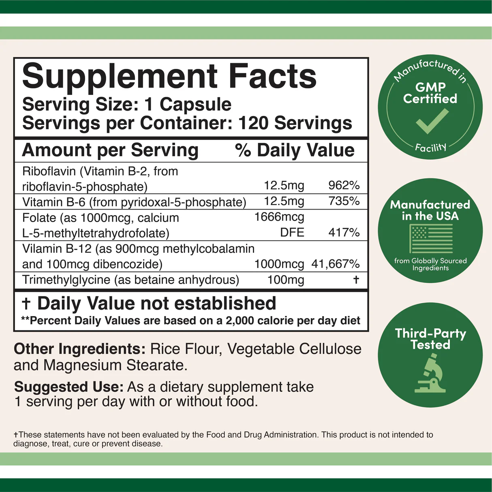
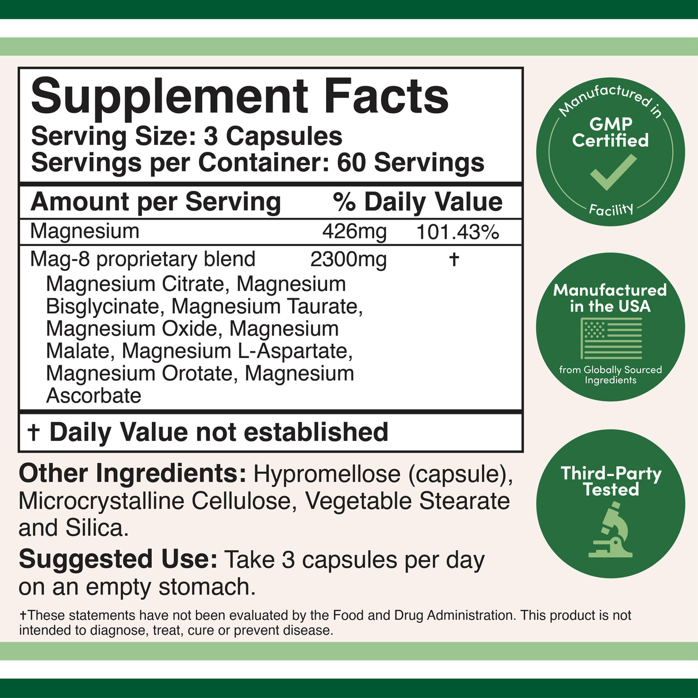
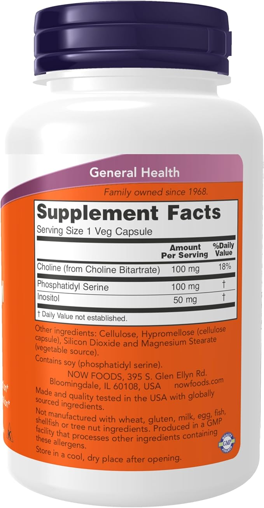
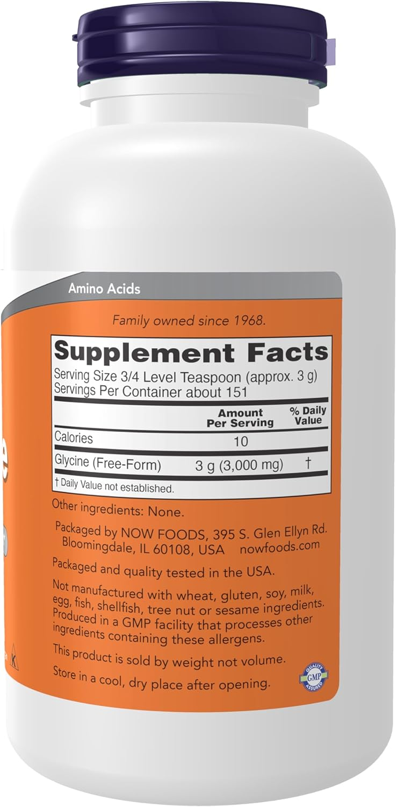
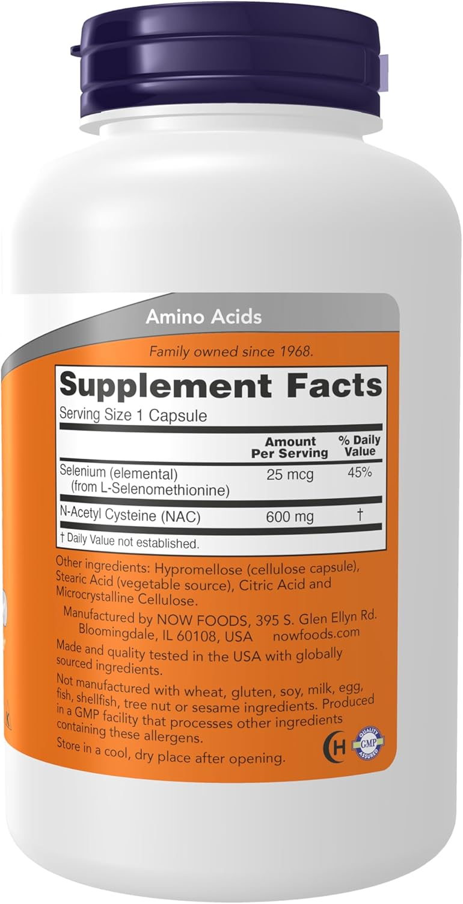
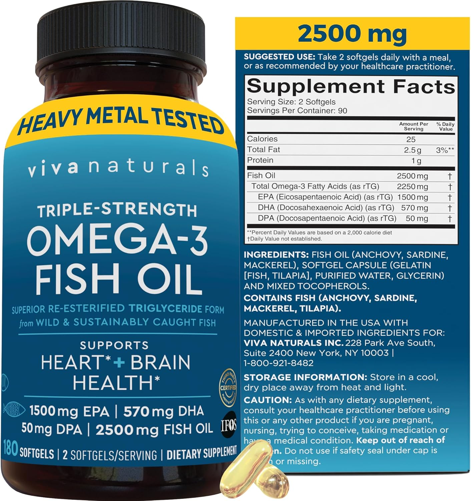

# Supplement Ingredient Breakdown

## Methylated Multivitamin

**Serving Size**: 1 Capsule
**Servings per Container**: 120 Servings
**GMP Certified**, Manufactured in USA, Third-Party Tested

### Active Ingredients (per serving)

| Ingredient | Amount | Form | % Daily Value |
|---|---|---|---|
| Riboflavin (Vitamin B2) | 12.5mg | Riboflavin-5-phosphate | 962% |
| Vitamin B6 | 12.5mg | Pyridoxal-5-phosphate (P5P) | 735% |
| Folate | 1000mcg | Calcium L-5-methyltetrahydrofolate | 417% |
| Vitamin B12 | 1000mcg | 900mcg methylcobalamin + 100mcg dibencozide | 41,667% |
| Trimethylglycine (TMG) | 100mg | Betaine anhydrous | † |

**† Daily Value not established**

### Other Ingredients

- Rice Flour
- Vegetable Cellulose
- Magnesium Stearate

### Suggested Use

Take 1 capsule per day with or without food.

### Notes

- 2 capsules daily per protocol (your dosage) = 2000mcg folate + 2000mcg B12 + 25mg B2 + 25mg P5P + 200mg TMG
- All forms are methylated/active (not synthetic)
- High B vitamin content supports methylation pathway (MTHFR)

---

## Magnesium Glycinate (Mag-8 Blend)

**Brand**: Doublewoods Supplements
**Serving Size**: 3 Capsules
**Servings per Container**: 60 Servings
**GMP Certified**, Manufactured in USA, Third-Party Tested

### Active Ingredients (per serving)

| Ingredient | Amount | % Daily Value |
|---|---|---|
| Magnesium | 426mg | 101.43% |
| Mag-8 proprietary blend | 2300mg | † |

**† Daily Value not established**

### Mag-8 Proprietary Blend

- Magnesium Citrate
- Magnesium Bisglycinate
- Magnesium Taurate
- Magnesium Oxide
- Magnesium Malate
- Magnesium L-Aspartate
- Magnesium Orotate
- Magnesium Ascorbate

### Other Ingredients

- Hypromellose (capsule)
- Microcrystalline Cellulose
- Vegetable Stearate
- Silica

### Suggested Use

Take 3 capsules per day on an empty stomach.

### Notes

- Your protocol: 4 servings daily = 1704mg elemental magnesium + 9200mg proprietary blend
- Multiple magnesium forms support different metabolic pathways
- Bisglycinate form particularly supports methylation and neurotransmitter function

---

## Phosphatidyl Serine (PS) with Choline

**Brand**: NOW Foods
**Serving Size**: 1 Veg Capsule
**Made in USA**, GMP Facility
**Family owned since 1968**

### Active Ingredients (per serving)

| Ingredient | Amount | % Daily Value |
|---|---|---|
| Choline (from Choline Bitartrate) | 100mg | 18% |
| Phosphatidyl Serine | 100mg | † |
| Inositol | 50mg | † |

**† Daily Value not established**

### Other Ingredients

- Cellulose
- Hypromellose (cellulose capsule)
- Silicon Dioxide
- Magnesium Stearate (vegetable source)

### Allergen Information

- Contains soy (phosphatidyl serine)
- Not manufactured with: wheat, gluten, milk, egg, fish, shellfish, tree nuts
- Produced in GMP facility that processes other allergens

### Suggested Use

Take as directed per protocol.

### Notes

- Your protocol: 300mg PS per evening (3 capsules) at 6-7 PM
- Critical timing: concentrated dose (not spread throughout day) for cortisol modulation
- Takes 30-60 minutes to become effective
- Phosphatidyl serine supports mood and cortisol response
- Choline supports methylation and cognitive function

---

## Glycine Powder

**Brand**: NOW Foods
**Serving Size**: 3/4 Level Teaspoon (approx. 3g)
**Servings Per Container**: About 151
**Made in USA**, GMP Facility
**Family owned since 1968**

### Active Ingredients (per serving)

| Ingredient | Amount | % Daily Value |
|---|---|---|
| Calories | 10 | — |
| Glycine (Free-Form) | 3g (3000mg) | † |

**† Daily Value not established**

### Other Ingredients

None.

### Allergen Information

- Not manufactured with: wheat, gluten, soy, milk, egg, fish, shellfish, tree nuts, sesame
- Produced in GMP facility that processes other allergens

### Suggested Use

Mix with water or beverage.

### Notes

- **Your v1.5 protocol**: 3-5g evening + 5-10g bedtime
- **Your v2 plan**: Increase to 6-10g bedtime dose (monitor stomach tolerance)
- Pure free-form glycine (no additives)
- Sold by weight, not volume
- Supports: sleep quality, temperature regulation, GABA modulation, Phase II detoxification, glutathione production
- Take 60-90 minutes before bed for optimal effect

---

## N-Acetyl Cysteine (NAC)

**Brand**: NOW Foods
**Serving Size**: 1 Capsule
**Made in USA**, GMP Facility
**Family owned since 1968**

### Active Ingredients (per serving)

| Ingredient | Amount | % Daily Value |
|---|---|---|
| Selenium (elemental from L-Selenomethionine) | 25mcg | 45% |
| N-Acetyl Cysteine (NAC) | 600mg | † |

**† Daily Value not established**

### Other Ingredients

- Hypromellose (cellulose capsule)
- Stearic Acid (vegetable source)
- Citric Acid
- Microcrystalline Cellulose

### Allergen Information

- Not manufactured with: wheat, gluten, soy, milk, egg, fish, shellfish, tree nuts, sesame
- Produced in GMP facility that processes other allergens

### Suggested Use

Take as directed per protocol.

### Notes

- **Your v1.5 protocol**: 600-1200mg flexible timing (blunts daytime energy)
- **Your v2 plan**: Move to evening only to preserve daytime energy
- Provides: Glutathione precursor (critical for detoxification)
- Supports: Phase II detoxification, antioxidant defense
- Includes selenium for glutathione peroxidase support
- Important for NAT2 slow acetylator (your genetic profile)
- Helps buffer Phase I metabolite buildup (due to CYP1B1 +/+)

---

## Vitamin D3 + K2 Liquid

**Serving Size**: 30 Drops (1 mL)
**Servings per Container**: 30 Servings
**GMP Certified**, Manufactured in USA, Third-Party Tested

### Active Ingredients (per serving)

| Ingredient | Amount | % Daily Value |
|---|---|---|
| Vitamin D3 (as Cholecalciferol) | 125mcg | 625% |
| Vitamin K2 (K2VITAL/II-Trans Menaquinone-7) | 200mcg | 167% |

### Other Ingredients

- Medium Chain Triglyceride (MCT) Oil

### Suggested Use

Take 1 mL per day with or without food.

### Notes

- Liquid form allows flexible dosing
- D3 + K2 synergy important (K2 directs calcium metabolism)
- Supports: bone health, immune function, neurological processes
- Vitamin D stimulates enzymes that create dopamine
- Relevant to VDR variants (your heterozygous VDR Bsm/Taq status)
- MCT oil as carrier (medium-chain triglycerides for absorption)

---

## Fish Oil - Triple Strength Omega-3

**Brand**: Viva Naturals
**Serving Size**: 2 Softgels
**Servings Per Container**: 90
**Heavy Metal Tested**, Manufactured in USA

### Active Ingredients (per serving)

| Ingredient | Amount | % Daily Value |
|---|---|---|
| Calories | 25 | — |
| Total Fat | 2.5g | 3%** |
| Protein | 1g | — |
| Fish Oil | 2500mg | † |
| Total Omega-3 Fatty Acids | 2250mg | † |
| EPA (Eicosapentaenoic Acid) | 1500mg | † |
| DHA (Docosahexaenoic Acid) | 570mg | † |
| DPA (Docosapentaenoic Acid) | 50mg | † |

**† Daily Value not established**

### Ingredients

- Fish Oil (from Anchovy, Sardine, Mackerel)
- Softgel Capsule (Gelatin, Fish, Tilapia)
- Purified Water
- Glycerin
- Mixed Tocopherols (antioxidant)

### Allergen Information

- Contains: Fish (anchovy, sardine, mackerel, tilapia)
- Heavy metal tested
- Wild & sustainably caught fish
- Superior re-esterified triglyceride form

### Suggested Use

Take 2 softgels daily with a meal, or as recommended by your healthcare practitioner.

### Notes

- **Your v1.5 protocol**: Flexible timing (morning + evening combo triggers stress)
- **Your v2 plan**: Move to 3 capsules evening only (avoids morning/evening stress trigger)
- Supports: heart + brain health, inflammation modulation
- Triple strength: 1500mg EPA + 570mg DHA per serving
- Re-esterified form (better absorption than regular fish oil)
- Important for mood support, anti-inflammatory effects
- Omega-3s support neurotransmitter function

